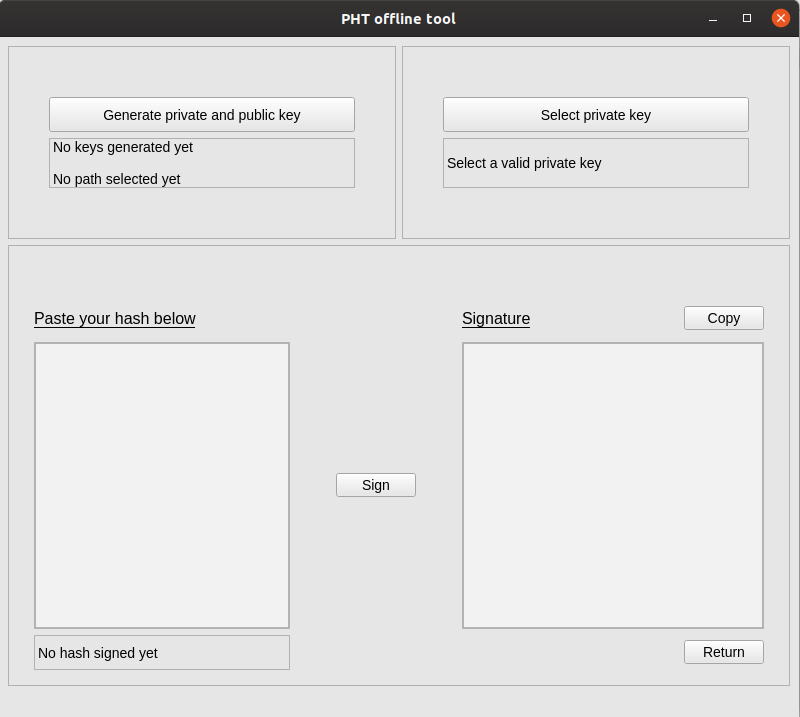
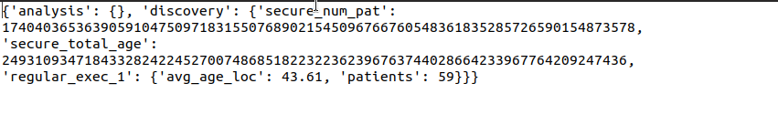
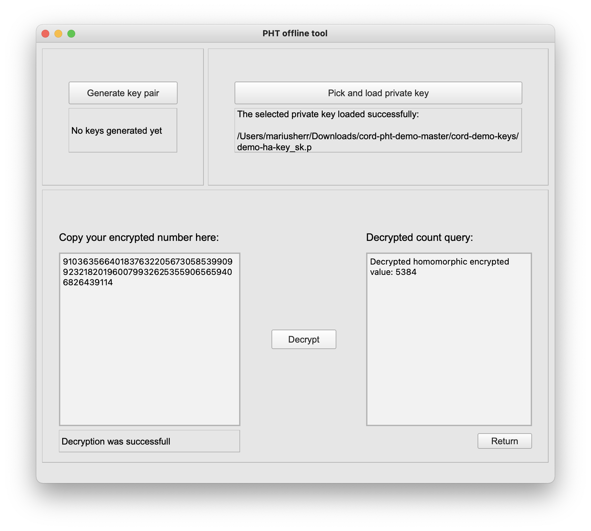
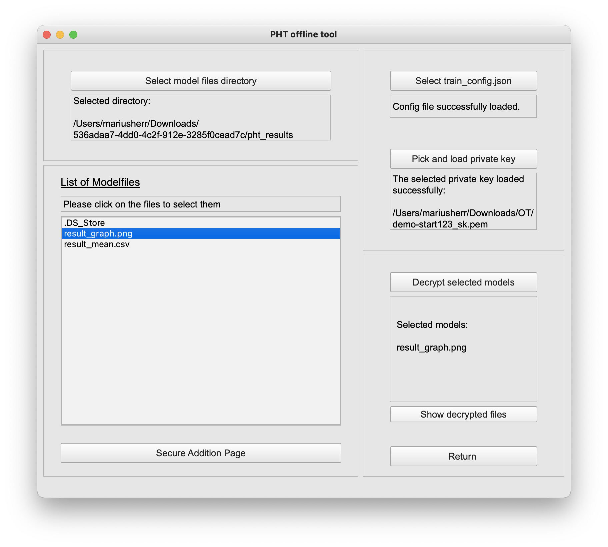

# PHT Public Documentation
*** 
*Author:* Felix Bötte  
*Created:* xx/04/2021  
*Version:* 1.0.1  
***
The following will be a documentation to provide detailed explanations about the steps which need
to be done for the execution of each feature. These explanations are helping the user understand how to use 
a feature and allow easy setup with no to little preknowledge. 
***
## Table of Contents
1. Usage of UI - Train Proposals
2. User Creation
3. Station Setup
4. Run Trains
5. Usage of Offline-Tool
***


## Usage of UI - Train Proposals

In the following section you will find an in-depth guide on how to use the user interface (UI) to create and submit your
own analysis-trains over one or more stations.

### User Interface
The UI is the central control interface [pht-ui.personalhealthtrain.de](pht-ui.personalhealthtrain.de)
to interact with the PHT. Its main tasks are the administration of stations and train proposals
but also the submission of analysis-trains and consequentially receiving encrypted results.

### Train Proposal

1. Add User Keys in the setting section and press "Change" to save your public keys
in Vault.

   <br/><br/>
   
   
   
   <br/><br/>

2. To add a new proposal go on the left navigation bar and select the "Proposal" section

   * You can generate a sample text with the "Test Data" button
   * Station authorities can approve or reject the train now.
   
   <br/><br/>
   
   <br/><br/>

3. To add a new train go on the left navigation bar and select "Trains" where you can choose
   your train type and specify the Proposal.

   <br/><br/>
   
   <br/><br/>

4. Now you can select the stations to execute the train on and specify a query (json valid)
   that is used to retrieve data from the corresponding FHIR-server.

   <br/><br/>
   
   <br/><br/>
   
5. Now upload your analysis code (entrypoint.py)

   * Disable “Directory mode” before uploading file
   * Press the “Hochladen” button
   * Toggle the right switch to the appearing entrypoint.py-file to select it
   * Specify the programming language
   * Press "Next"
   
   <br/><br/>
   
   <br/><br/>
   
6. Now press ["Generate Hash"](#sign-hash) and copy the hash to the Offline Tool to sign 
   it with your private key. Paste the signature from the Offline Tool to the "Signed Hash"
   box and press "Next". You will get a response from the UI that the train building process began.
   
   
   <br/><br/>
   
   <br/><br/>

7. Now go back to your initial proposal and press "Build".
   Then refresh the Page and press "Run" again. 
   
   <br/><br/>
   
   <br/><br/>
   
   <br/><br/>
   
   <br/><br/>
   
8. After each specified station has successfully executed the train (see Section 4: "Run Trains"),
encrypted results key can be downloaded on the same "Proposal" page. 
   You can use the "Download" button to do so. 
    <br/><br/>
   
9. In order to execute the train and do the station setup by yourself, follow the next subsection of 
 station setup and the train execution with an Apache Airflow instance.
***

## 2. User Creation

The feature of creating users is restricted to users with admin access to the UI.
1. If you have an admin status you will see at the top left bar a second button next to "Settings" called "Admin".

   <br/><br/>
   
   <br/><br/>


2. To add a new user go to "Users" on the left side navigation bar

    * Specify a name of the new user
    * Specify an initial password
    * Specify an email adress

   <br/><br/>
   
   <br/><br/>

   
3. To add a customised role for one of the users go to "Roles" on the left side navigation bar

   * Specify a role name
   * Specify a provider role ID
   
   <br/><br/>
   
   <br/><br/>
   
4. After creating a role you can choose the permissions you want to give the  corresponding role.
A user needs at least the permission "stationEmployee" to run trains

   <br/><br/>
   
   <br/><br/>
   
5. A general overview over the selection of permissions: You can select "Permissions" on the left side 
navigation bar
   
   <br/><br/>
   
   <br/><br/>
   
6. Finally, to create and manage realms, one can also move to the left side navigation bar and select "Realms".

   <br/><br/>
   
   <br/><br/>
   
7. Specify the name and the ID for the realm. The chosen realm ID can be seen on the list of all realms. 
The ID is required to match between the deployment of the station.

   <br/><br/>
   
   <br/><br/>

***

## 3. Station Setup

### Station 
A station is an essential access point to patient data of the PHT.
It is based on Apache Airflow and allows persistent and monitored executions of trains.
The airflow web interface allows for the manual execution of trains and access to log files.
  <br/><br/>
After one followed the steps described before of submissing your own train the following
steps will be the execution of the train in the corresponding station. In subsection ["Run Trains"](#Run Trains)
you can find a description on how to operate the Apache-Airflow station instance to execute trains.


### Deployment
In order to operate your own station, please follow the instructions within the readme
of the [station-repository](https://gitlab.com/PersonalHealthTrain/implementations/germanmii/difuture/station/airflow-rest-api/-/tree/mg)

### Installation

Here is a short summary of some relevant steps for the station-setup: 

#### Specify Public- / Private Key

Each station requires a public and private key pair. In order to deploy a station generate
your own pair with the Offline-Tool as outlined in step 7 or use your existing keypair. 
The path to the Private Key file has to be specified within the *docker-compose.yml* file.

```json
version: '3.7'
volumes:
    ...
services:
    db:
        ...
    adminer:
        ...
    redis:
        ...
    airflow:
        build: .
        restart: always
        volumes:
            - ...
            - ./private_key.pem:/opt/private_key.pem
        environment:
            - ...
            - STATION_PRIVATE_KEY_PATH=/opt/private_key.pem
            - STATION_ID=X
```

#### Specify Station ID

Each station requires a pseudo identifier also seen as *STATION_ID* above. This can be arbitrary,
but has to match with the corresponding *STATION_ID* in the UI. The ID has to be defined similiar to the Private- / Public Keys
in the *docker-compose.yml* file, e.g. above. 

#### Environments

A station can have global envs to specify certain trains. 
Editing entries within the *docker-compose.yml* file requires a restart with:

```
$ docker-compose down
$ docker-compose build
$ docker compose up -d
```


## 4. Run Trains

In order to execute a train that was specified already in the UI you need to have an Apache Airflow instance
deployed as outlined in the previous subsection.
After you successfully installed the station, go the the aiflow interface, using http://localhost:8080/.

1. Turn on the "run_train" DAG
   <br/><br/>
   
   <br/><br/>
2. Press "Trigger DAG"
3. Specify the DAG configs (example below)

```json
{
  "repository": "<HARBOR-REPOSITORY>/<STATION_ID>/<TRAIN-IMAGE>",
  "tag": "latest",
  "env": {"FHIR_ADDRESS": "<FHIR-ADRESS>","FHIR_USER": "<ID>","FHIR_PW": "<PSW>"}
}
```

   <br/><br/>
   
   <br/><br/>

4. During execution you can refresh the station status
5. Log files can be accessed during execution of each process
   
   <br/><br/>
   
   <br/><br/>
   
6. After successful execution the rebased image is pushed back and labeled "pht_next" to be processed by the Train Router. All nodes on the DAG should be green after a successfull execution

   <br/><br/>
   
   <br/><br/>
   
7. Now your corresponding train that you created in the UI is ready and results can be 
downloaded 
***
## 5. Usage Offline-Tool

The Offline Tool is a Python (PyQt5) application with a GUI to decrypt results,
manage keys and sign hashes locally during the submission process of a train.
   <br/><br/>
First, download the binaries for your operating system from [https://pht.medic.uni-tuebingen.de/](https://pht.medic.uni-tuebingen.de/)
and install it on your local computer.

### Create Keys

1. Start the application
2. From the opening page select "Security Values"

   <br/><br/>
   
   <br/><br/>

3. Select "Generate private and public key"
   
   <br/><br/>
   
   <br/><br/>


4. Specify the directory where the keys should be saved
5. Specify the name of the key-pair
6. The public key needs to be stored in the UI to create trains

### Sign Hash 

1. Start the application
2. From the opening Page select "Security Values"
3. Press "Select private key" and choose the matching private key to the public key stored in the UI
4. Paste hash from train wizard (UI) into the left box (this hash is generated based on the query and entrypoint and guarantees that no manipulation has occured)
5. Press "Sign"
6. Press "Copy" to copy the signed hash to clipboard
7. Proceed to paste the signature into the train-wizard to continue train submission

   <br/><br/>
   
   <br/><br/>
   

### Homomorphic Decryption

1. Start the application
2. From the opening page select "Secure Addition"
3. Generate key-pair (Public & Private Key for Homomorphic Decryption)
4. Select the corresponding Private Key (identical to 3. step of hash signing)
5. Copy your encrypted number into the text field (encrypted number is found in the decrypted results from the
   previous step)
   
   <br/><br/>
   
   <br/><br/>
   
6. Press "Decrypt"
7. Now in the right textfield appears the decypted count query

   <br/><br/>
   
   <br/><br/>


### Decrypt results

1. After executing train the UI download the results to your local machine
2. Extract the folder and extract results and the train_config.json
3. Start the application
4. From the opening page select "Model Page"
5. Select the path to the encrypted result directory (where you extracted the results before)
6. Select the train_config.json
7. Select your Private Key (the one used for the train submission in the UI)

   <br/><br/>
   
   <br/><br/>
   
8. Select the models on the left list-box that you wish to decrypt.
If a file is selected, it will appear in the right box.
9. Press "Decrypt selected models".
10. You can move to the corresponding directory with the decrypted results by pressing
"Show decrypted files".