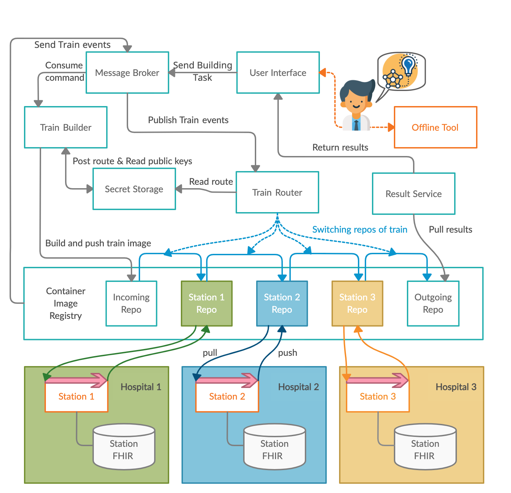

# Introduction

## Mission Statement
What problems are we looking to solve.

## Terminology

## Architecture

## Security
Add link to paper. Security Protocol

### Security Protocol
The following flow chart depicts the security protocol used for protecting participating stations against malicious code,
as well as encrypting any stored results using envelope encryption.   
This ensures that only approved algorithms 
are executed and that only previously registered participants in an analysis can access the results. 

## Technologies
### Apache Airflow
### Vue JS

