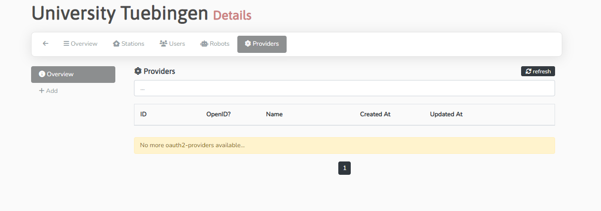
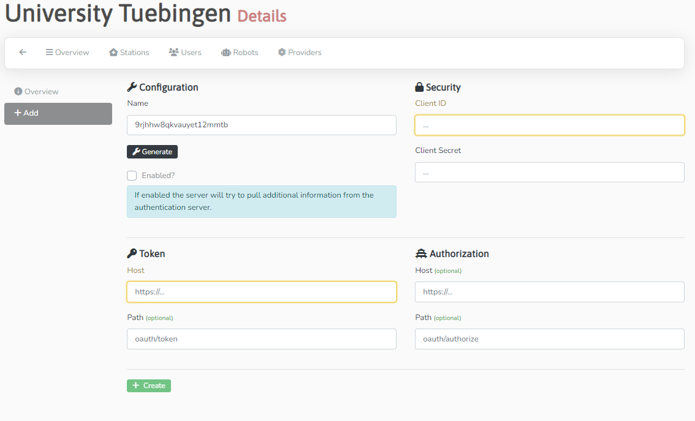

## Station settings

In order to manage the stations settings the user needs to be assigned the **Station Authority** role.

!!! warning
   When changing the settings of your station in the central UI you need to restart your local station.


### Configuring an OIDC provider
To allow each participant to control their own distribution of roles, the central UI allows the user to configure an OIDC provider which
can be used to authenticate users associated with their realm.
OIDC providers can be configured in the admin panel of the central UI under **Auth -> Realms** in the providers tab.
[](../images/ui_images/providers_overview.png)


Clicking on the **Add** button on the left will allow you to configure a new OIDC provider.

#### Keycloak settings

[](../images/ui_images/provider_add.png)

This provider can then be selected in the login screen to authenticate users belonging to your realm.

The following settings are used with Keycloak as identity provider:
```
Name: <Display name in UI>
Client-ID: <name of client specified in keycloak>
Client Secret: <secret of client if set to confidential>

Token
Host: <URL to realm> (e.g. https://DOMAIN.de/auth/realms/PHT_DEV/)
Path: protocol/openid-connect/token

Authorization
Host: Auto from Token
Path: protocol/openid-connect/auth
```

### Registering/Updating a public key

1. Within the admin area (top left, next to Home), you need to select **Auth -> Realms** within the left navigation.
2. You can see a list of stations. Choose the station you want and click on the blue "List"-Symbol.
3. In *Station* the public key can be entered into the field *PublicKey*.

### Updating the Station ID

1. Follow the steps 1 and 2 of "Registering/Updating a public key"
2. On the same page you can find **SecureID**, which you can adapt.
   [](../images/ui_images/pk_station.png)

### Setting/Updating harbor username and password

1. Within the admin area (top left), you need select **Realms** within the left navigation.
2. Select the Station you want to edit
3. In *Harbor* the credentials, project name and path can be modified - webhooks for API communication can be tested.
   [](../images/ui_images/harbor_station.png)


## Review
Before accepting a proposal or a train the requested data and the code contained in a train need to be reviewed. While
removing network access and the built-in security features should be sufficient to prevent the transfer of data, the 
code still needs to be reviewed to prevent any unwanted behaviour.

### Proposal
Proposals are the top level organizational unit of the PHT system. Proposals describe the goal of an analysis, the 
requested data and an estimation of the potential risk of participation. When the description of the proposal meets the
local requirements of your station, a user with the role of **Station Authority** can accept the proposal, otherwise
the proposal is rejected (optionally with comments for improvement).

Joining a proposal means that users of other stations also joined in the proposal can select your station as a
participant in the trains they create for this proposal.

### Train
Trains contain analysis code that will be executed on the data requested in the proposal. The code is user submitted, so
while the security protocol prevents the transfer of any unencrypted data via docker images and restricted network access,
prevents direct transfer of any data, the code still needs to be reviewed in order to prevent any kind of malicious behaviour.


