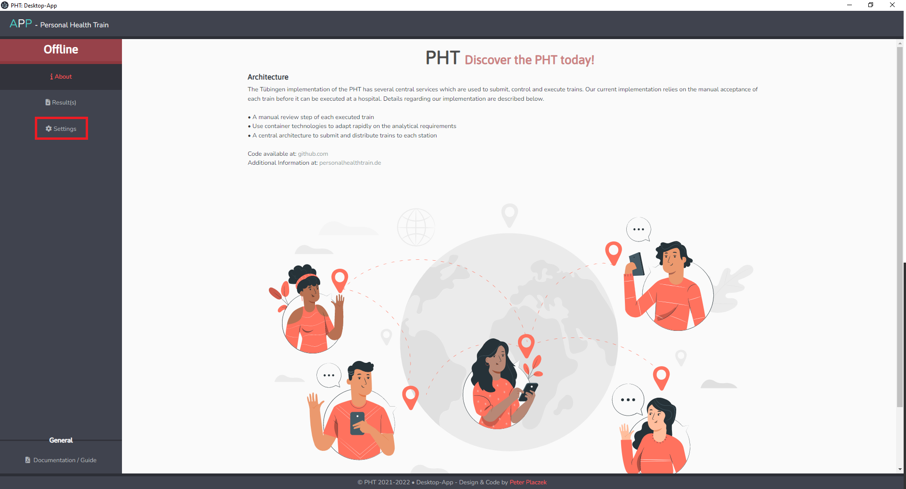
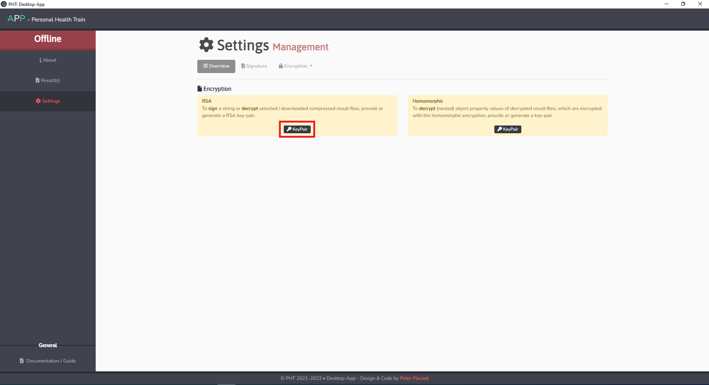
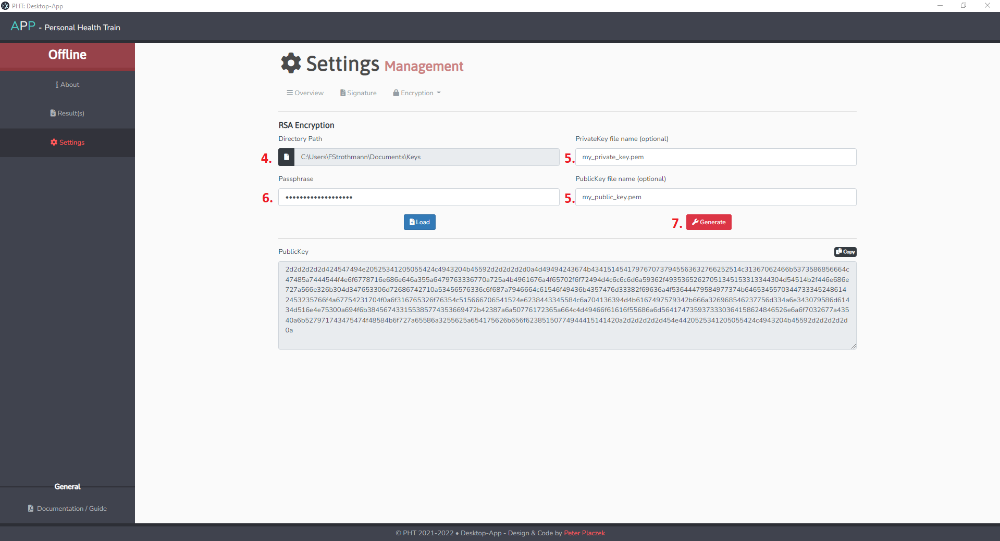
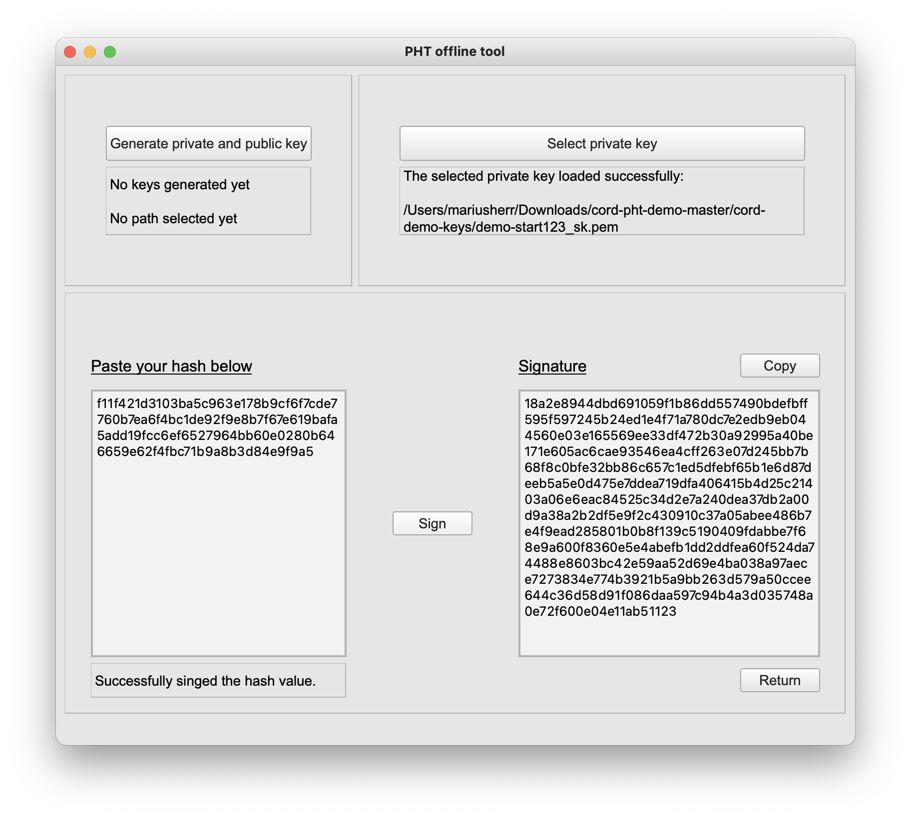

# PHT Desktop App

The PHT Desktop App is the offline tool of the User Interface. It can sign hashes locally during the submission process of a train. After successful execution, it is used to decrypt downloaded results and key management.  

## Installation

Follow the description of the README.md file on the github-website where you can download the programm:[https://github.com/PHT-Medic/desktop-app](https://github.com/PHT-Medic/desktop-app).

1. Install [Yarn](https://classic.yarnpkg.com/en/) (yarn is used as dependency manager)
2. Build application via this command in a command line window: ```yarn run build```
3. Serve application with hot reloading : ```yarn run dev ```

## Create Keys

1. Start the application.
2. From the Homepage click on "Settings" on the left hand side.
      [](../images/offline_tool_images/settings_colored.png)
      <br/><br/>

3. Click on the "KeyPair"-button of the RSA box.
      [](../images/offline_tool_images/encryption_colored.png)
      <br/><br/>


4. Specify the directory where the keys should be saved.
5. Specify the filename of the private and the public key on the right side.
6. Select a passphrase for your private key. (If you press enter, an empty password will be used)
7. Click on the "Generate"-button.
      
      [](../images/offline_tool_images/rsa_encryption_colored.png)
      <br/><br/>
!!! TODO
      At this point 

## Sign Hash 

1. Start the application.
2. From the opening Page select "Security Values".
3. Press "Select private key" and choose the matching private key to the public key stored in the UI. If the keyfile is stored with a password, please enter it.
4. Paste hash from train wizard (UI) into the left box (this hash is generated based on the query and entrypoint and guarantees that no manipulation of the algorithm has occurred).
5. Press "Sign".
6. Press "Copy" to copy the signed hash to clipboard.
7. Proceed to paste the signature into the train-wizard to continue train submission.

      <br/><br/>
      
      <br/><br/>

## Decrypt results

1. After executing train the UI download the results to your local machine
2. Extract the folder and extract results and the train_config.json
3. Start the application
4. From the opening page select "Model Page"
5. Select the path to the encrypted result directory (where you extracted the results before)
6. Select the train_config.json
7. Select your Private Key (the one used for the train submission in the UI)

      <br/><br/>
      
      <br/><br/>

8. Select the models on the left list-box that you wish to decrypt
   If a file is selected, it will appear in the right box
9. Press "Decrypt selected models"
10. You can go to the corresponding directory with the decrypted results by pressing
    "Show decrypted files". The results are saved on your local machine and you are responsible protecting those   

## Homomorphic Decryption

1. Start the application
2. From the opening page select "Secure Addition"
3. Generate key-pair (Public & Private Key for Homomorphic Decryption)
4. Select the corresponding Private Key (identical steps as in section hash signing)
5. Copy your encrypted paillier number into the text field (encrypted number is found in the decrypted results from the
   previous step)
   
      <br/><br/>
      
      <br/><br/>
   
6. Press "Decrypt"
7. Now in the right textfield appears the decypted count query

      <br/><br/>
      
      <br/><br/>

If you want to calculate the average age over multiple sites, this cannot be done trivially.
You need to know the total age and total number of patients over all sites. By saving both decrypted numbers,
you can manually calculate such afterwards. Average age: `5384 / 144 = 37,38`.


