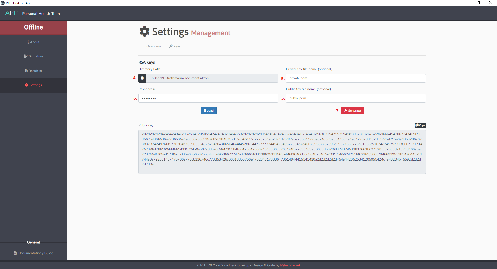
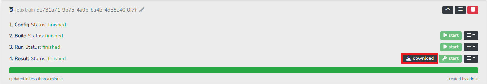
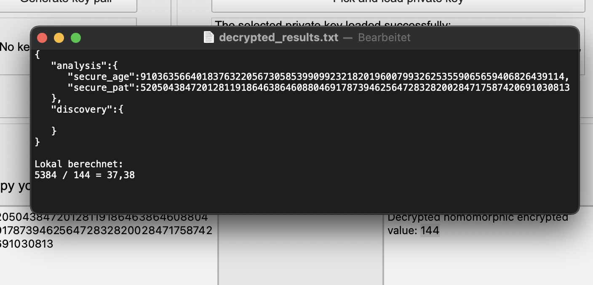

# PHT Desktop App

The PHT Desktop App is the offline tool of the User Interface. It can sign hashes locally during the submission process of a train. After successful execution, it is used to decrypt downloaded results and key management.  

## Installation

Follow the description of the README.md file on the github-website where you can download the program:[https://github.com/PHT-Medic/desktop-app](https://github.com/PHT-Medic/desktop-app/tree/v0.2.0).

1. Clone the repository: ```git clone https://github.com/PHT-Medic/desktop-app.git```
2. Install [Yarn](https://classic.yarnpkg.com/en/) (yarn is used as dependency manager)
3. Build application inside the cloned-repo via this command in a command line window: ```yarn run build```
4. Serve application with hot reloading : ```yarn run dev ```

## Create Keys
This is an example to create an *RSA-key-pair*. The same steps are requiered for creating a *homomorphic key-pair*.

1. Start the application.
2. From the Homepage click on **Settings** on the left hand side.
      [](../images/offline_tool_images/settings.png)
      
3. Click on the **KeyPair**-button of the RSA box.
      [](../images/offline_tool_images/encryption.png)
      

4. Specify the directory where the keys should be saved.
5. Specify the filename of the private and the public key on the right side.
6. Select a passphrase for your private key. (If you press enter, an empty passphrase will be used)
7. Click on the **Generate**-button.
      
      [](../images/offline_tool_images/rsa_encryption.png)

## Sign Hash 

To perform the signature on a hash value it is necessary that the application knows your keypair (private and public key). (See *Create Keys* above). 

1. In the Menu click on **Signature**.
2. In the **Hash** textfield you should paste the generated HashKey from step 2.6 in [User Guide -> User interface](user_guide/user_interface.md).
3. Click on **Sign**.
4. Copy the signed hash from the **Signature (read only)** textfield and proceed step 2.6 in [User Guide -> User interface](user_guide/user_interface.md).
      [](../images/offline_tool_images/signature.png)

## Decrypt results

1. After executing a training in the UI, you can download the results to your local machine.
      [](../images/offline_tool_images/download_results.png)
2. Open the Desktop App -> Load your keys to the Desktop App via Settings -> Click on **results** on the menu. 
      
      You will be directed to an overview where you can click on **Select Result-File(.tar)** button. Chose the downloaded results-file from the UI and press load.
      [](../images/offline_tool_images/load_results.png)
3. A new view appears where you can chose which files you want to save.

      By clicking on the **x**-buttons, you can delete those files from the working space (you do not delete them from the results_file.tar, only a deletion from the Desktop App!).
      
      By clicking on the **save**-button you start downloading the remaining files. A new folder will be placed in the same folder where you have selected the result-File.tar.

## Homomorphic Decryption

1. Start the application
2. From the opening page select **Secure Addition**
3. Generate key-pair (Public & Private Key for Homomorphic Decryption)
4. Select the corresponding Private Key (identical steps as in section hash signing)
5. Copy your encrypted paillier number into the text field (encrypted number is found in the decrypted results from the
   previous step)
   
      <br/><br/>
      
      <br/><br/>
   
6. Press **Decrypt**
7. Now in the right textfield appears the decrypted count query

      <br/><br/>
      
      <br/><br/>

If you want to calculate the average age over multiple sites, this cannot be done trivially.
You need to know the total age and total number of patients over all sites. By saving both decrypted numbers,
you can manually calculate such afterwards. Average age: `5384 / 144 = 37,38`.


