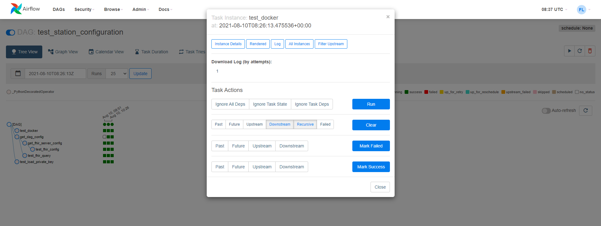

# PHT Station

This section will provide installation instructions for installing a PHT Station.<br>**It assumes that the station has been
registered in the UI.**

## Installation
Visit
the [station repository](https://github.com/PHT-Medic/station)
to view the code (the installation instructions can also be found here).

### Requirements

* [Docker](https://docs.docker.com/get-docker/) and [docker-compose](https://docs.docker.com/compose/install/) need to be
installed.<br> 
* For the default installation to work the ports `8080` and `5432` need to be available on localhost.
* In the ideal case you open the cloned repository in an IDE such as Pycharm, so you have all files listed and can use terminal immediately.
* If you are on a Windows Computer you need to change the line seperator to the "Unix/macOS"-style for the airflow directory. In Pycharm you can follow these steps:
    1. Select the airflow folder
    2. Click on File in the top-left corner
    3. Click on File Properties -> Line Separators -> LF - Unix and maxOS (\n)


### Install with docker-compose
1. Clone the repository: ```git clone https://github.com/PHT-Medic/station.git```

2. Navigate into the cloned project `cd station` and edit the `.env` file with your local configuration.

    | Attribute | Explanation |
    |:------:|------|
    |`STATION_ID`| Chosen identifier of the station (match central UI configuration) |
    |`STATION_PRIVATE_KEY_PATH`| Path to the private key on the local filesystem that should be mounted as a volume |
    |`AIRFLOW_USER`| Admin user to be created for the airflow instance |
    |`AIRFLOW_PW`| Password for the airflow admin user |
    |`HARBOR_API_URL`|Url of the central harbor instance |
    |`HARBOR_USER`| Username to authenticate against harbor |
    |`HARBOR_PW`| Password to authenticate against harbor |
    |`STATION_DATA_DIR`| Absolute path of the directory where the station stores the input data for trains.<br>This path is also used by the FHIR client to store the query results before passing them to the trains |
    |`FHIR_ADDRESS`<br>(optional) | Address of the default FHIR server connected to the station <br>(this can also be configured per train) |
    |`FHIR_USER`<br>(optional) | Username to authenticate against the FHIR server using Basic Auth |
    |`FHIR_PW`<br>(optional) | Password for FHIR server Basic Auth |
    |`FHIR_TOKEN`<br>(optional) | Token to authenticate against the FHIR server using Bearer Token |
    |`CLIENT_ID`<br>(optional) | Identifier of client with permission to acces the FHIR server |
    |`CLIENT_SECRET`<br>(optional) | Secret of above client to authenticate against the provider |
    |`OIDC_PROVIDER_URL`<br>(optional) | Token url of Open ID connect provider <br>(e.g. keycloak, that is configured for the FHIR server) |
    |`FHIR_SERVER_TYPE`<br>(optional) | Type of FHIR server <br>(PHT FHIR client supports IBM, Hapi and Blaze FHIR servers) |

3. Create a volume for the station: ```docker volume create pg_station```
4. Bring up the project by running: ```docker-compose build```

#### Using pre-built images (Optional)
If there are issues while building the airflow container you can use our prebuilt images to run the airflow instance.<br>
Edit the airflow service in the docker-compose.yml file and replace the build command without prebuilt image:
```
# ------------- ommitted ------------
services:
  airflow:
    # remove the build command
    build: './airflow'
    # replace with the image command
    image: ghcr.io/pht-medic/station-airflow:latest
    volumes:
      - /var/run/docker.sock:/var/run/docker.sock
# ------------- ommitted ------------
```

### First steps with running the station
1. Run ```docker-compose up -d```
2. Check that the logs do not contain any startup errors with ```docker-compose logs -f```
3. Go to ```http://localhost:8080``` nd check whether you can see the web interface of Apache Airflow
4. Login to the airflow web interface with the previously set user credentials

## Getting started with Airflow
Trains and other station tasks are executed via airflow DAGs. The DAGs can be triggered via the airflow web interface,
which is available under ```http://127.0.0.1:8080``` on the station machine. 
The execution of the DAGs can also be monitored in the webinterface.

### Login
The first time you access the webinterface you will be prompted to log in. Enter the credentials set in the `.env` file 
to login as admin.

[](../images/station_images/airflow_login.png)

### Triggering the test DAG
To test the configuration of the station as defined in the `.env` file, trigger the DAG named `test_station_configuration`
in the user interface.  
A DAG is triggered in the UI by clicking on the "play" button, where it can be started either with or without a json 
file containing additional configuration for the DAG run.

[](../images/station_images/airflow_ui.png)

Trigger the DAG without any additional configuration to check if the station is properly configured. A notification should
appear in the UI that the DAG has been triggered.  

To monitor the execution click on the name of the DAG. You should see the individual tasks contained in the DAG as well as
their status in the UI. If all tasks are marked as success, the station is properly configured and can connect to harbor as well as a FHIR server.

!!! warning 
    If you did not provide any FHIR_Server configurations in the .env-file, then this Trigger will fail, because this test will try to connect to the FHIR_server. All the nodes will be marked as red or orange except the "get_dag_config"

[](../images/station_images/test_config_dag.png)

### Accessing logs

The logs stored during the execution of a DAG can be accessed for each individual task by clicking the colored,squared/circled - indicator next to the name of the task. In the new pop-up window you can see in the top a list of options. There you can pick "Log" to view the Log of this task.

[](../images/station_images/task_logs.png)

If there are any errors stacktraces can be found in these logs, as well as any other output of the tasks (stdout, stderr)

[](../images/station_images/task_log_details.png)

### Running a train

To execute a train that is available for your station, trigger the `run_train` DAG, with configuration options specifying
the train image to be pulled from harbor and executed as well as additional environment variables or volumes. A template
train configuration is displayed below. 

```json
{
  "repository": "<HARBOR-REGISTRY>/<STATION_ID>/<TRAIN-IMAGE>",
  "tag": "latest",
  "env": {"FHIR_ADDRESS": "<FHIR-ADDRESS>","FHIR_USER": "<ID>","FHIR_PW": "<PSW>"}
}
```

Replace the placeholders with the values of the train image to execute, and other
variables with the values corresponding to the stations configuration and paste it into the configuration form shown in 
the following image.

[](../images/station_images/trigger_run_train.png)


