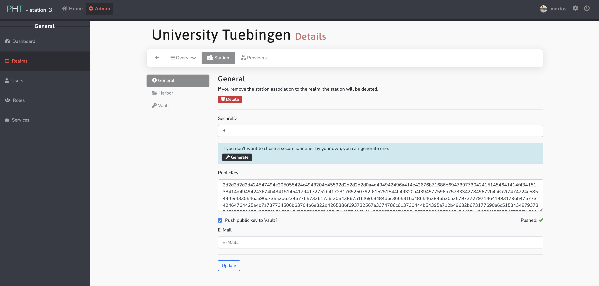
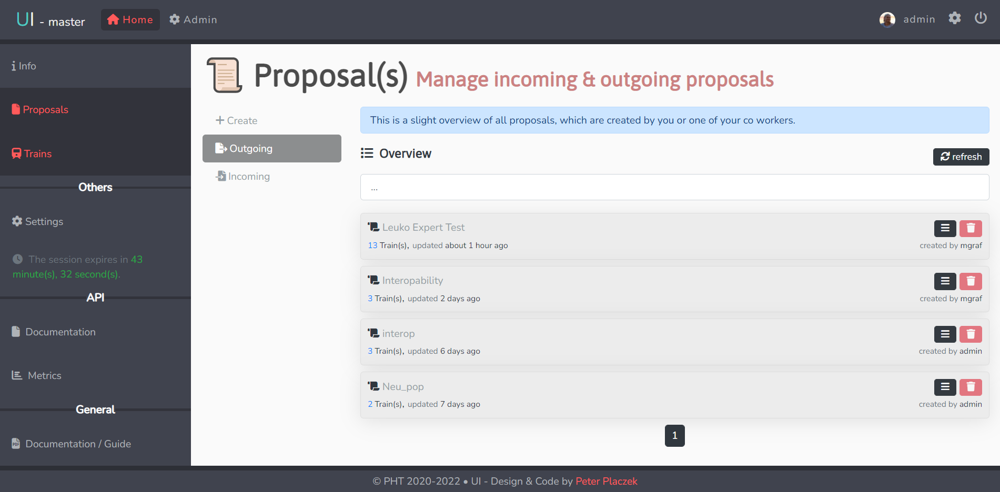
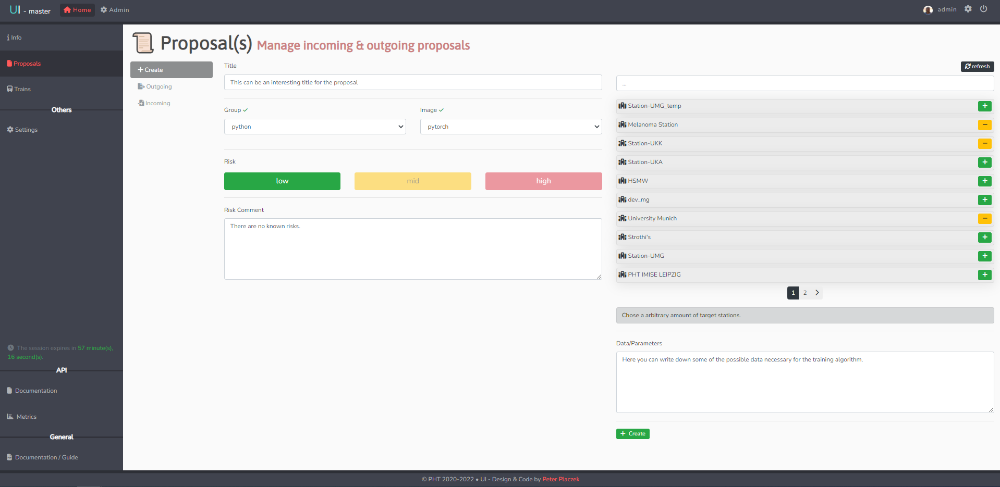
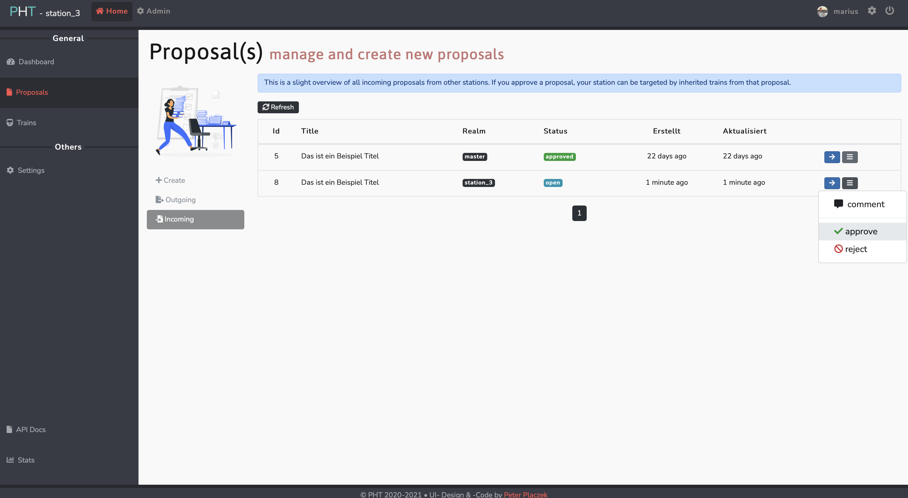

# User Interface
The UI is the central control interface [pht-ui.personalhealthtrain.de](https://pht-ui.personalhealthtrain.de)
to interact with the PHT. Its main tasks are the administration of stations and train proposals
but also the submission of analysis-trains and consequently receiving encrypted results.

## Account Configuration

### Station
In order to have permissions to change public keys or harbor credentials the user needs permissions of a **Station Authority**.
#### Registering/Updating a public key
1. Within the admin area (top left), you need select **Realms** within the left navigation.
2. Select the Station you want to edit
3. In *General* the public key can be entered. Please don't change the id, if you do not rebuild the station with a new id.
   

#### Setting/Updating harbor username and password
1. Within the admin area (top left), you need select **Realms** within the left navigation.
2. Select the Station you want to edit
3. In *Harbor* the credentials, project name and path can be modified - webhooks for API communication can be tested.

#### Updating the Station ID
!!! warning 
    Please don't change the id, if you do not rebuild the station with the new id.

1. Within the admin area (top left), you need select **Realms** within the left navigation.
2. Select the Station you want to edit
3. In *General* the id of the station can be changed.

### User

#### Registering/Updating a public key
After signing in for the first time register a public in the UI (Vault). 
Under Settings and Keys a public key can be uploaded from disk or pasted into the displayed form.
The form accepts hex and PEM encoded RSA public keys.  
Clicke the save changes button to update the public key associated with your account.

## Proposals

Proposal are an organizational unit in the PHT, a proposal represents the collaboration between different participants
in regard to a specific research or analysis project.  
It contains an initial risk assessment as well as a high level description of the requested data.

### Creating a new Proposal
Specify a train proposal by entering the required information, such each side can approve the analysis.

### Accepting an incoming proposal
Within the incoming section of each station, a station authority can independently decide to comment, approve or reject
a study proposal for analysis. In order to do such, click on the proposal menu on the right side of the corresponding proposal.

## Train submission
1.If it is your first train submission, you need to add User Keys in the setting section and press "Change" to save your public keys
in Vault.

     
   
   

     

2. If you have already created a train proposal you can skip this step. If you haven't you can do such by clicking on the left navigation bar and select the "Proposal" section

   * You can generate a sample text with the "Test Data" button
   * Station authorities can approve or reject the train now.
   
     
   
     

3. To add a new train go on the left navigation bar and select "Trains" where you can choose
   your train type and specify the Proposal.

     
   
     

4. Now you can select the stations to execute the train on and specify a query (json valid)
   that is used to retrieve data from the corresponding FHIR-server.

     
   
     
   
5. Now upload your analysis code (entrypoint.py)

   * Disable “Directory mode” before uploading file
   * Press the “Hochladen” button
   * Toggle the right switch to the appearing entrypoint.py-file to select it
   * Specify the programming language
   * Press "Next"
   
     
   
     
   
6. Now press ["Generate Hash"](#sign-hash) and copy the hash to the Offline Tool to sign 
   it with your private key. Paste the signature from the Offline Tool to the "Signed Hash"
   box and press "Next". You will get a response from the UI that the train building process began.
   
   
     
   
     

7. Now go back to your initial proposal and press "Build".
   Then refresh the Page and press "Run" again. 
   
     
   
     
   
     
   
     
   
8. After each specified station has successfully executed the train (see Section 4: "Run Trains"),
encrypted results key can be downloaded on the same "Proposal" page. 
   You can use the "Download" button to do so. 
      
   
9. In order to execute the train and do the station setup by yourself, follow the next subsection of 
 station setup and the train execution with an Apache Airflow instance.