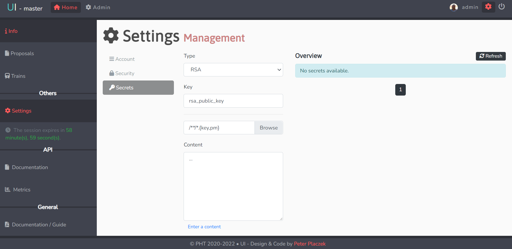
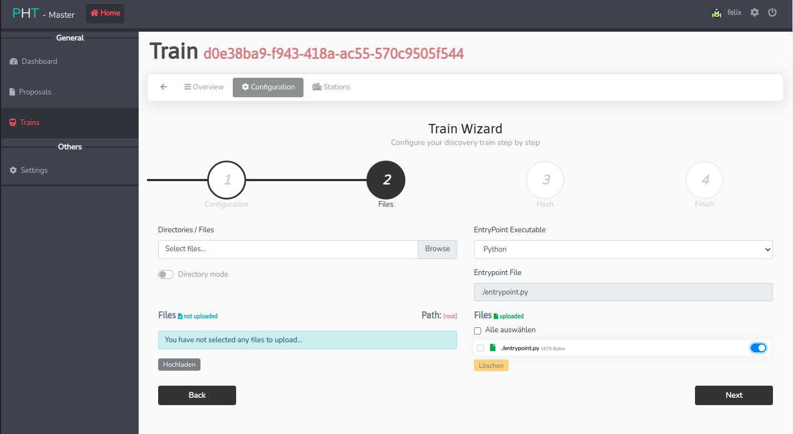

## User Interface
The UI is the central control interface [pht-ui.personalhealthtrain.de](pht-ui.personalhealthtrain.de)
to interact with the PHT. Its main tasks are the administration of stations and train proposals
but also the submission of analysis-trains and consequentially receiving encrypted results.

## Usage of UI - Train Proposals

In the following section you will find an in-depth guide on how to use the user interface (UI) to create and submit your
own analysis-trains over one or more stations.

### Train Proposal

1. Add User Keys in the setting section and press "Change" to save your public keys
in Vault.

     
   
   
   
     

2. To add a new proposal go on the left navigation bar and select the "Proposal" section

   * You can generate a sample text with the "Test Data" button
   * Station authorities can approve or reject the train now.
   
     
   
     

3. To add a new train go on the left navigation bar and select "Trains" where you can choose
   your train type and specify the Proposal.

     
   
     

4. Now you can select the stations to execute the train on and specify a query (json valid)
   that is used to retrieve data from the corresponding FHIR-server.

     
   
     
   
5. Now upload your analysis code (entrypoint.py)

   * Disable “Directory mode” before uploading file
   * Press the “Hochladen” button
   * Toggle the right switch to the appearing entrypoint.py-file to select it
   * Specify the programming language
   * Press "Next"
   
     
   
     
   
6. Now press ["Generate Hash"](#sign-hash) and copy the hash to the Offline Tool to sign 
   it with your private key. Paste the signature from the Offline Tool to the "Signed Hash"
   box and press "Next". You will get a response from the UI that the train building process began.
   
   
     
   
     

7. Now go back to your initial proposal and press "Build".
   Then refresh the Page and press "Run" again. 
   
     
   
     
   
     
   
     
   
8. After each specified station has successfully executed the train (see Section 4: "Run Trains"),
encrypted results key can be downloaded on the same "Proposal" page. 
   You can use the "Download" button to do so. 
      
   
9. In order to execute the train and do the station setup by yourself, follow the next subsection of 
 station setup and the train execution with an Apache Airflow instance.