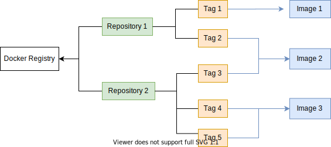

= The Tübingen Personal Health Train Components
Lukas Zimmermann <luk.zim91@gmail.com>
1.0, July 29, 2014, Asciidoctor 1.5 article template
:toc:
:icons: font
:quick-uri: https://asciidoctor.org/docs/asciidoc-syntax-quick-reference/

This document extensively describes the components of the Personal Health Train (PHT)
components, which are developed in Tübingen, Germany, as part of the Medical Informatics
Initiative (MI-I) of Germany.

== The Container Registry

=== General Remarks

The container registry is a central component which stores container images
and makes them available repositories and tags. The container registry
used in this component is Harbor, a CNCF-supported cloud-native registry.

Clients usually interact with images inside the registry using the Docker Registry API (TODO link).
This API decouples physical images via repositories and tags.

.Combinations of repository and tags are used to reference image.

Repositories have a structure that resemble file system paths on Unix-like operating systems,
where individual path components are separated by a forward slash ("/"). Examples of repositories are
`library/nginx` and `jboss/keycloak`.
Repositories are also the resource on which access control is usually applied to.

Tags distinguish different image versions of a repository.

The full specification of repositories can be accessed at the 
https://docs.docker.com/registry/spec/api/#overview[official Docker Registry API Specification].

NOTE: Repositories are also part of the HTTP API of Docker registries, since
the repository paths are used in paths for querying.

=== The Harbor Registy

Harbor is an open source cloud native container registry (https://goharbor.io/[link]).
Besides an implementation of Docker Registy, Harbor also provides:

  * User management with role-based access control on repositories.
  * Image vulnerability scan
  * Image signatures
  * A web user interface
  * Image replication across multiple Harbor instances

In particular, Harbor's multi-tenant capabilities and image security features
render Harbor as a good fit for the container registy used in the PHT.

Harbor provides access control by storing the images in separate so-called _projects_.
Harbor projects are the central resource on which access to Harbor is controlled.
Hence, we decided to assign each participating Train Station exactly one Harbor project
to separate image stores and fully leverage the multi-tenant capabilities of Harbor.
Each Train Station is one tenant.

For each repository in Harbor, the first path component is the name of the project the repository belongs
to. As an example, the repository `library/nginx` belongs to the library project and
the `station1/my-train` repository belongs to the `station1` project.
Access to the repository `library/nginx` is then controlled via the `library` project.

Figure 1 shows that repositories and actual container image are losely coupled.
This allows to simply create new repositories by referencing an already
existing image with an already existing repository.
In Harbor, this operation is called `retag`. 

The PHT requires the ability to conceptionally copy images from one tenant (Harbor project)
to another. Harbor allows this with the `retag` operation.
Now, the PHT aims to automate this process to implement conceptional routes that images
travel from one Train Station to another.
For this, we need two furher components:

* A format to declaratively describe such 

== Routes

This is a paragraph with a *bold* word and an _italicized_ word.

This is another paragraph.footnote:[I am footnote text and will be displayed at the bottom of the article.]

=== Second level heading

.Unordered list title
* list item 1
** nested list item
*** nested nested list item 1
*** nested nested list item 2
* list item 2

This is a paragraph.

.Example block title
====
Content in an example block is subject to normal substitutions.
====

.Sidebar title
****
Sidebars contain aside text and are subject to normal substitutions.
****

==== Third level heading

[#id-for-listing-block]
.Listing block title
----
Content in a listing block is subject to verbatim substitutions.
Listing block content is commonly used to preserve code input.
----

===== Fourth level heading

.Table title
|===
|Column heading 1 |Column heading 2

|Column 1, row 1
|Column 2, row 1

|Column 1, row 2
|Column 2, row 2
|===

====== Fifth level heading

[quote, firstname lastname, movie title]
____
I am a block quote or a prose excerpt.
I am subject to normal substitutions.
____

[verse, firstname lastname, poem title and more]
____
I am a verse block.
  Indents and endlines are preserved in verse blocks.
____

== First level heading

TIP: There are five admonition labels: Tip, Note, Important, Caution and Warning.

// I am a comment and won't be rendered.

. ordered list item
.. nested ordered list item
. ordered list item

The text at the end of this sentence is cross referenced to <<_third_level_heading,the third level heading>>

== First level heading

This is a link to the https://asciidoctor.org/docs/user-manual/[Asciidoctor User Manual].
This is an attribute reference {quick-uri}[which links this text to the Asciidoctor Quick Reference Guide].
